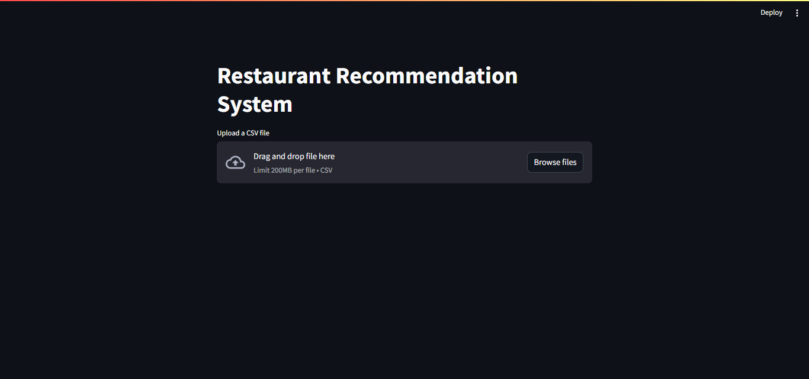
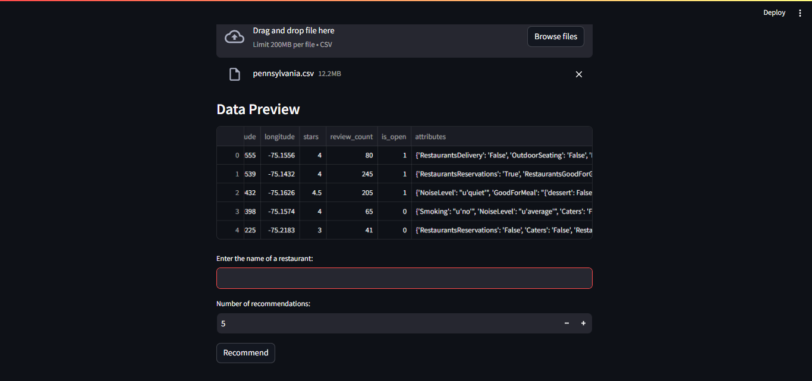
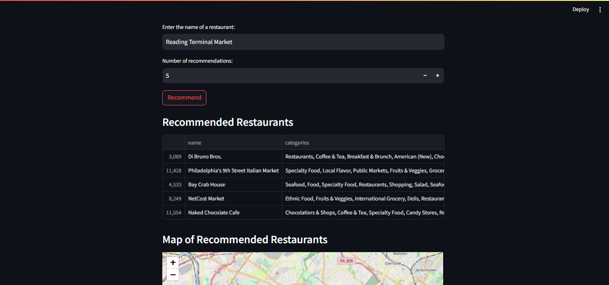
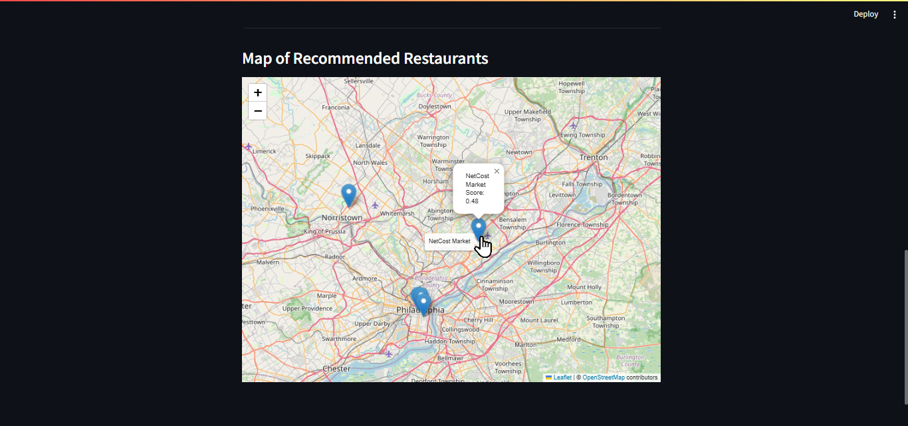

# Restaurant Recommendation System

## Overview
This project implements a restaurant recommendation system using content-based filtering. The system recommends restaurants based on their categories using a TF-IDF vectorization approach and cosine similarity.

## Features
- Upload a CSV file containing restaurant data.
- Enter the name of a restaurant to receive recommendations.
- View a preview of the uploaded data.
- Display recommended restaurants along with their similarity scores.
- Visualize recommended restaurant locations on a map.

## Requirements
- Python 3.x
- Streamlit
- Pandas
- Scikit-learn
- Folium
- Streamlit-Folium
- Plotly_express

## Installation
1. Clone the repository:
   ```bash
   git clone <repository-url>
   cd <repository-directory>
   ```

2. Install the required packages:
   ```bash
   pip install -r requirements.txt
   ```

## Usage
1. Run the Streamlit app:
   ```bash
   streamlit run app.py
   ```

2. Open your web browser and navigate to `http://localhost:8501`.

3. Upload a CSV file containing restaurant data with the following columns:
   - `name`: Name of the restaurant
   - `categories`: Categories associated with the restaurant
   - `latitude`: Latitude of the restaurant location
   - `longitude`: Longitude of the restaurant location

4. Enter the name of a restaurant in the input field and specify the number of recommendations you want.

5. Click the "Recommend" button to view the recommended restaurants and their locations on the map.

## Example CSV Format
```csv
name,categories,latitude,longitude
Restaurant A,Italian|Pizza,40.7128,-74.0060
Restaurant B,Chinese|Noodles,40.7138,-74.0070
Restaurant C,Mexican|Tacos,40.7148,-74.0080
```
## Result Preview





## License
This project is licensed under the MIT License. See the LICENSE file for details.

## Acknowledgments
- [Streamlit](https://streamlit.io/)
- [Pandas](https://pandas.pydata.org/)
- [Scikit-learn](https://scikit-learn.org/)
- [Folium](https://python-visualization.github.io/folium/)
- [Data sourced from Yelp's academic dataset](https://www.kaggle.com/datasets/yelp-dataset/yelp-dataset?resource=download)
